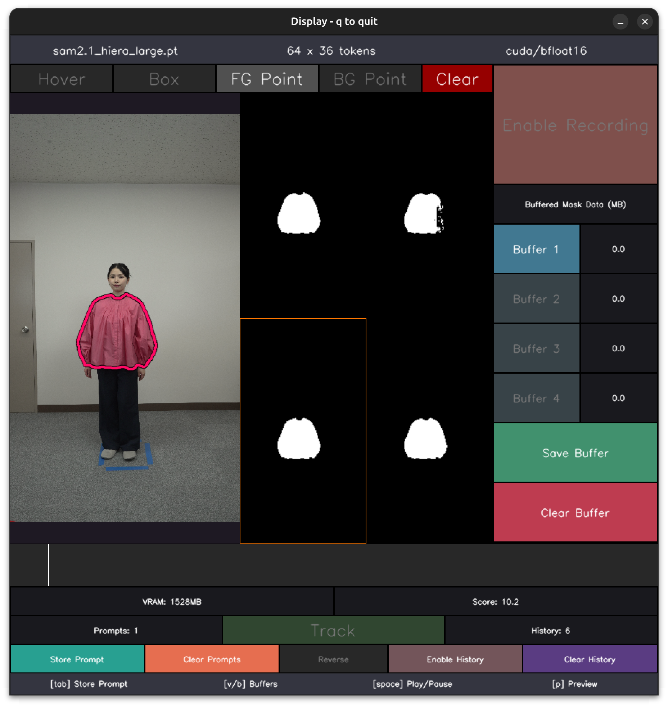

# Instructions on Training a New Garment Checkpoint

## Items Required
- A camera capable of recording video in 4K resolution (most smartphones are sufficient).
- The garment intended for virtual try-on.
- A person to wear the garment during recording.

## Step 1
Recording a video of a person wearing the garment following the instruction of [this paper](https://arxiv.org/abs/2506.10468).
The predefined poses can be find [here](assets/pose_guidance/symmetric.pdf).
Please note that you don't need to strictly follow the predefined poses (the more diverse the poses, the better).

## Step 2
Performing garment segmentation to the recorded video.
there are many available methods. We recommend [this repository](https://github.com/heyoeyo/muggled_sam), which requires only minimal interaction to achieve desirable garment segmentation results.

Exporting the segmentation results as a tar file.

Work in progress ...